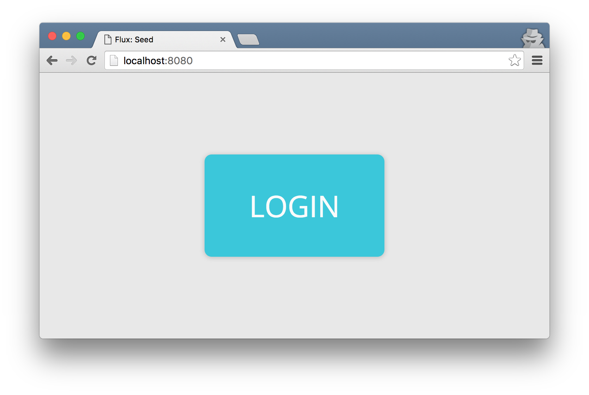
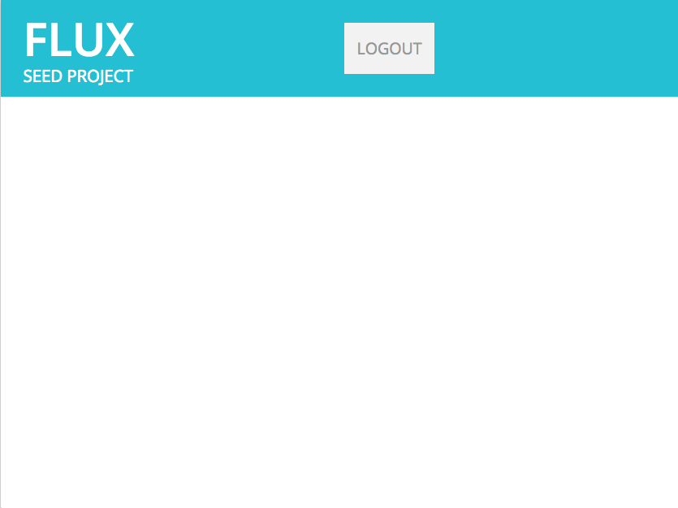

# Chapter 1: Log in to Flux

* [OpenID Connect](#openid-connect)
* [The User Login Flow](#the-user-login-flow)
* [Implementing Login](#implementing-login)
* [Logging Out of Flow](#logging-out-of-flux)
* [Download Chapter 1 Source Code](#download-chapter-1-source-code)

## <a id="openid-connect"></a>OpenID Connect

Flux requires all apps to use [OpenID Connect](http://openid.net/connect/) for authentication (even the ones we build). OpenID Connect is an established, secure way for 3rd party developers like yourself to access data on behalf of a Flux user.

Before you can begin working with the Flux API, you will need to have users authenticate with Flux and grant you access to their data in the form of a token. Fortunately, you won't need a deep understanding of OpenID Connect. We'll do most of the work for you by way of an optional "login helper", which is used throughout this tutorial.

## <a id="the-user-login-flow"></a>The User Login Flow

Your apps will need to prompt users to log in to Flux. Our tutorial will begin as an app with just a simple login button. When the button is pressed, a browser window will open and take your user to https://flux.io to enter their Flux username and password (or proceed as a previously authenticated user of Flux).

When a user first loads your app, they'll be asked to authorize access to Flux on their behalf. Once your app is authorized by your user, they'll be redirected to a URL of your liking - typically the same page that originally initiated login.

## <a id="implementing-login"></a>Implementing Login

Create a new file with the path `js/config.js` containing the contents below. This will declare a constant named `config` that can be used throughout your app:

js/config.js
```js
const config = {
  url: 'http://localhost:8080', // your url
  flux_url: 'https://flux.io', // flux url
  flux_client_id: '', // your app's client id
}
```

You'll need to set `flux_client_id` to the client ID you created for your app in [Before You Begin](../README.md#before-you-begin). For now, the config above assumes you will want to develop on localhost port 8080. If you're using a different host or port, you'll need to add it to the list of valid "post-authorization" URLs for your app (using the [Flux App Manager](https://flux.io/developer/apps)).

Now, add the following to a new file, `js/index.html`:

index.html
```html
<!DOCTYPE html>
<html lang="en">
  <head>
    <title>Flux: Seed</title>
    <meta charset="utf-8">
    <meta name="viewport" content="width=device-width, user-scalable=no, minimum-scale=1.0, maximum-scale=1.0">
    <link rel="stylesheet" type="text/css" href="css/style.css">
    <!-- nice font -->
    <link href='https://fonts.googleapis.com/css?family=Open+Sans:400,600,700,800' rel='stylesheet' type='text/css'>
    <!-- who doesn't love jQuery... -->
    <script src="https://ajax.googleapis.com/ajax/libs/jquery/2.2.2/jquery.min.js"></script>
    <!-- configuration variables -->
    <script src="js/config.js"></script>
    <!-- the Flux JS SDK and helpers-->
    <script src="https://npmcdn.com/flux-sdk-browser@0.4/dist/flux-sdk-min.js"></script>
    <script src="https://npmcdn.com/flux-sdk-helpers@0.1/dist/flux-sdk-helpers.min.js"></script>
    <!-- helper functions for using the Flux SDK -->
    <script src="js/helpers.js"></script>
    <!-- main application logic -->
    <script src="js/index.js"></script>
  </head>
  <body>
    <!-- login page -->
    <div id='login'>
      <div class='button'>Login</div>
    </div>
  </body>
</html>
```

Right now this is just HTML that exposes a login button for the user to click. We need to add some logic to bring this to life. First we need to create an instance of the Flux SDK and helper libraries for login. Copy the following code into a file `js/helpers.js`:

js/helpers.js
```js
// instantiate the Flux SDK with your app's client id
var sdk = new FluxSdk(config.flux_client_id, { redirectUri: config.url, fluxUrl: config.flux_url })
var helpers = new FluxHelpers(sdk)
```

You'll notice `FluxSdk` is instantiated using values from our `config` object, and `FluxHelpers` is created using an instance of the sdk. This separation makes it possible to use the SDK without helpers, in case you want more control over the login implementation. However, that is an advanced topic that will not be covered by this tutorial.

Over the course of this tutorial, we'll try to keep the logic for accessing Flux inside of `js/helpers.js`. The app's controller logic (code that controls the user interface) will be in a separate file `js/index.js`. Copy the following code into `js/index.js`:

js/index.js
```js
/**
 * Hide the login page and attach events to the logout button.
 */
function hideLogin() {
  // hide the login button
  $('#login').hide()
}

/**
 * Show the login page and attach events to the login button.
 */
function showLogin() {
  // ensure that the user is logged out and no longer stored on the page
  helpers.logout()
  // show the login button
  $('#login').css('display', 'flex')
  // attach event handler to the login button
  $('#login .button').click(function() { helpers.redirectToFluxLogin() })
}

/**
 * Start the application.
 */
function init() {
  // Check if we're coming back from Flux with the login credentials.
  helpers.storeFluxUser()
  // check that the user is logged in, otherwise show the login page
    .then(function() { return helpers.isLoggedIn() })
    .then(function(isLoggedIn) {
      if (isLoggedIn) {
        // if logged in, make sure the login page is hidden
        hideLogin()
        alert('You\'re logged in!')
      } else {
        showLogin();
      }
    })
}

// When the window is done loading, start the application.
window.onload = init
```

The `init` function is triggered when the page loads, and immediately checks to see if the user has logged in (using the login helper). If the user has not logged in with Flux, the "login" div is revealed via `showLogin` and an event handler is added to let us know when the login button is clicked. Upon clicking the login button, your user will be taken to Flux to authenticate and authorize access to your app.

You're ready to run your app! For the purposes of this tutorial, we'll use a simple command line server for Node called ["http-server"](https://github.com/indexzero/http-server). However, you should feel free to run whatever you're comfortable with. Assuming you have Node installed, use npm to install the server:

```
$ npm install http-server -g
```

After the you have http-server installed, navigate to the directory containing `index.html`, and start the server:

```
$ http-server
```

Open a browser and navigate to [http://localhost:8080](http://localhost:8080). You should see a screen similar to the following:



## <a id="logging-out-of-flux"></a>Logging Out of Flux

"You're logged in!" - that alert gets old pretty quickly. Let's take it out, and replace it with a logout button. Add the following code below the login div in `index.html`:

index.html
```html
<!-- main container -->
<div id='container' class="ui container">
  <!-- header -->
  <div id='header'>
    <div id='title'>
      <h1>FLUX</h1>
      <h2>Seed Project</h2>
    </div>
    <div id='actions'>
      <div id='logout'>logout</div>
    </div>
  </div>
</div>
```

Next, we need to add some logic to hide the login div (which exposes the container div positioned beneath it on the z-index). Add a click handler to the logout button in `hideLogin`:

js/index.js
```js
function hideLogin() {
  // hide the login button
  $('#login').hide()
  
  // attach the event handler to the logout button
  $('#logout').click(showLogin)
}
```

Now you can rip out that annoying alert message :)

js/index.js
```js
if (isLoggedIn) {
  // if logged in, make sure the login page is hidden
  hideLogin()
  alert('You\'re logged in!')
} else {
  showLogin();
}
```

Refresh your browser, and you should see something similar to the screenshot below. Press the logout button, and see what happens.



## <a id="download-chapter-1-source-code"></a>Download Chapter 1 Source Code

The files mentioned in this chapter can be conveniently [downloaded here](https://github.com/flux-labs/flux-seed/tree/master/tutorials/chapter_1_login). Be sure to set your own `flux_client_id` in `config.js` and point your local http server to the new directory!
