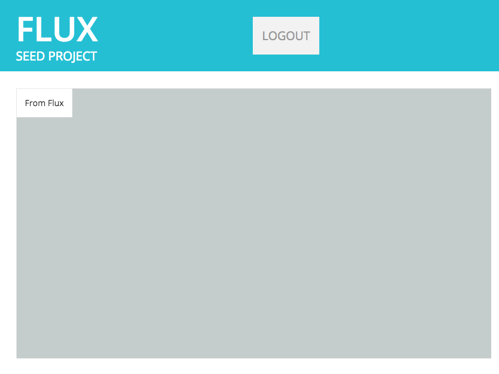
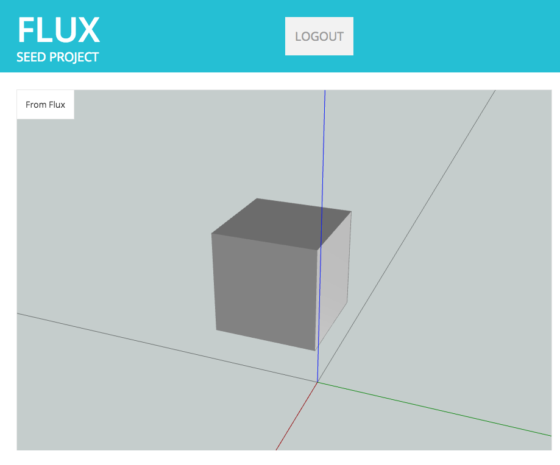
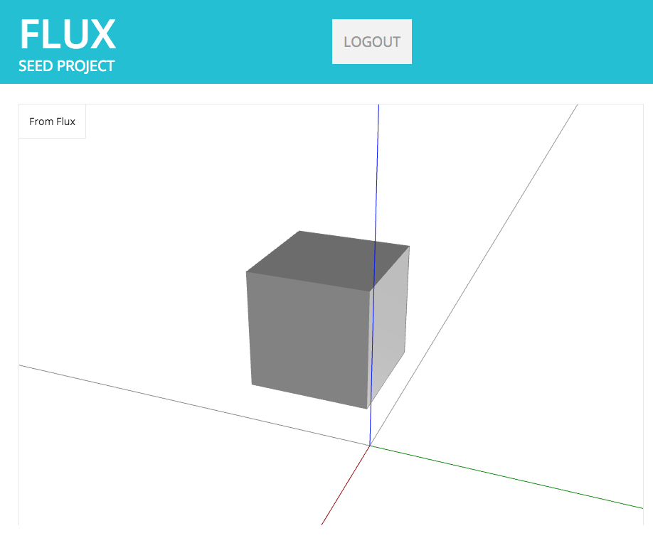

# Chapter 2: The Flux 3D Viewport

* [Instantiating the Flux 3D Viewport](#instantiating-the-flux-3d-viewport)
* [Viewing 3D Data in the Viewport](#viewing-3d-data-in-the-viewport)
* [Customizing the Viewport](#customizing-the-viewport)
* [Download Chapter 2 Source Code](#download-chapter-2-source-code)

&nbsp;

The same 3D viewport we use in the Flux web interface is also available to you as a developer. This chapter will explain how to add the 3D viewport into the sample app we started in Chapter 1.

## <a id="instantiating-the-flux-3d-viewport"></a>Instantiating the Flux 3D Viewport

In order to create a viewport, we will need to include a reference to the viewport script. Insert the following code just below the config.js script tag in `index.html`:

index.html
```html
...
<script src="js/config.js"></script>
<!-- the Flux Viewport -->
<script src="https://npmcdn.com/flux-viewport@0.8.0/dist/flux-viewport-bundle.global.js"></script>
<!-- the Flux JS SDK and helpers-->
<script src="https://npmcdn.com/flux-sdk-browser@0.4/dist/flux-sdk-min.js"></script>
...
```

We also need to create a placeholder for the viewport in our index.html, just below the header div:

index.html
```html
<!-- main container -->
<div id='container' class="ui container">
  <!-- header -->
  <div id='header'>
...
  </div>
  <!-- content-->
  <div id='content'>
    <!-- left column -->
    <div class='column'>
      <div id='output'>
        <div class='label'>From Flux</div>
        <!-- geometry viewport -->
        <div id='geometry'>
          <div id='view'></div>
        </div>
      </div>
    </div>
  </div>
</div>
```

Let's declare a variable for our viewport at the very top of `js/index.js` before anything else:

js/index.js
```js
var viewport
```

Also inside of `js/index.js`, add a new function named `initViewport`. The `initViewport` function instantiates the viewport, passing it an element it can use to append its own content - in our case, the div we just added to `index.html`.

js/index.js
```js
/**
 * Initialize the 3D viewport.
 */
function initViewport() {
  // attach the viewport to the #div view
  viewport = new FluxViewport(document.querySelector("#view"))
  // set up default lighting for the viewport
  viewport.setupDefaultLighting()
}
```

Lastly, we need to call `initViewport` from our `init` method, so it actually attempts to load.

js/index.js
```js
function init() {
  // Check if we're coming back from Flux with the login credentials.
  helpers.storeFluxUser()
  // check that the user is logged in, otherwise show the login page
    .then(function() { return helpers.isLoggedIn() })
    .then(function(isLoggedIn) {
      if (isLoggedIn) {
        // if logged in, make sure the login page is hidden
        hideLogin()
        // create the viewport
        initViewport()
      } else {
        showLogin();
      }
    })
}
```

Refresh the browser, and you should see a screen similar to the following:



## <a id="viewing-3d-data-in-the-viewport"></a>Viewing 3D Data in the Viewport

The viewport we just added is empty, and it needs some data to render. For now, let's keep things simple by pointing it to a static blob of JSON that represents a solid box. Add the following  code to a new file `js/box.js`, but don't worry much about what it means for now:

js/box.js
```js
var box_data = [
  {
    "dimensions": [
      2,
      2,
      2
    ],
    "origin": [
      0,
      0,
      0
    ],
    "primitive": "block",
    "units": {
      "dimensions": "meters",
      "origin": "meters"
    }
  }
]
```

Add a new script tag for `js/box.js` below the stylesheet reference in `index.html`:

index.html
```html
...
<link rel="stylesheet" type="text/css" href="css/style.css">
<script src="js/box.js"></script>
<!-- nice font -->
<link href='https://fonts.googleapis.com/css?family=Open+Sans:400,600,700,800' rel='stylesheet' type='text/css'>
...
```

Now, set the viewport's geometry to the variable we declared in `js/box.js` as `box_data`:

js/box.js
```js
function init() {
  checkLogin().then(() => {
    // if logged in, make sure the login page is hidden
    hideLogin()
    // create the viewport
    initViewport()
    //manually set the viewport's geometry to box_data
    viewport.setGeometryEntity(box_data)
  }).catch(showLogin)
}
```

Refresh the browser, and you should see something similar to the following:



## <a id="customizing-the-viewport"></a>Customizing the Viewport

Eww - that grey. We're going to make some simple adjustments to the default viewport configuration. You can find more advanced examples in the [viewport ](https://github.com/fluxio/flux-viewport/tree/master/demo)[documentation](https://github.com/fluxio/flux-viewport/tree/master/demo).

Update the `initViewport` function we created, by setting the clear (unrendered) area to white:

js/index.js
```js
function initViewport() {
  // attach the viewport to the #div view
  viewport = new FluxViewport(document.querySelector("#view"))
  // set up default lighting for the viewport
  viewport.setupDefaultLighting()
  // set the viewport background to white
  viewport.setClearColor(0xffffff)
}
```

Refresh your browser, and you should see something similar to the following:



## <a id="download-chapter-2-source-code"></a>Download Chapter 2 Source Code

The files mentioned in this chapter can be conveniently [downloaded here](https://github.com/flux-labs/flux-seed/tree/master/tutorials/chapter_2_viewport). Remember to set your own `flux_client_id` in `config.js` and point your local http server to the new directory!
