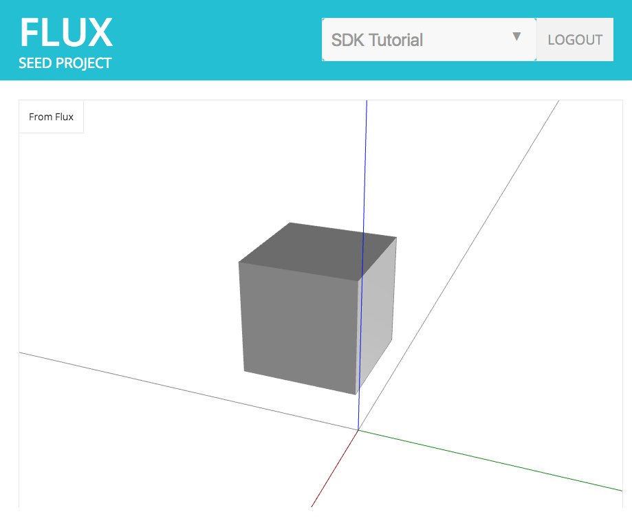
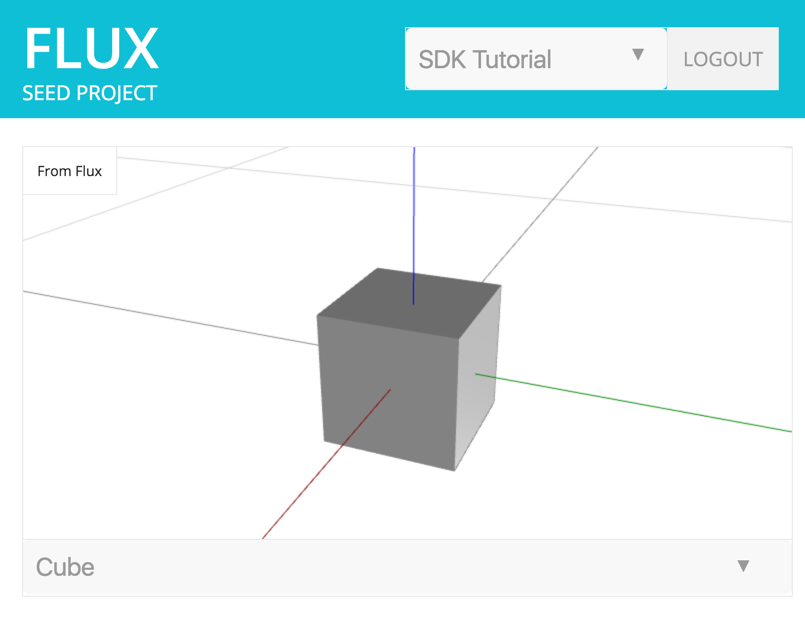

# Chapter 3: Reading Data from Flux

* [Flux Projects](#flux-projects)
* [Create an SDK Tutorial Project](#create-an-sdk-tutorial-proeject)
* [Accessing Projects](#accessing-projects)
* [The Project Data Table](#the-project-data-table)
* [Reading a Cell Value](#reading-a-cell-value)
* [Download Chapter 3 Source Code](#download-chapter-3-source-code)

&nbsp;

Users of your app can now log in to Flux, and view a static model of a cube in their browser. That’s pretty neat, but not super useful yet. In this chapter you’ll learn how to connect the viewport to live data that comes from Flux. In doing so, your app will be able to talk to any other tools that integrate with Flux. For example, SketchUp, Revit, Excel, Grasshopper, Dynamo, 3ds Max or AutoCAD!

## <a id="flux-projects"></a>Flux Projects

Before we dive in, it’s important to understand how Flux user data is organized. The highest level of organization is referred to as a "project". A project can be shared among multiple Flux users, each having permissions to read and possibly modify the the project. In order to work with user data, you’ll first have to designate a project to work with.

Once a user has has logged in and authorized your app, you’ll be able to access to their projects through the SDK. For the purposes of this tutorial, it’s recommended you log into your app as yourself and work with your own projects.

## <a id="create-an-sdk-tutorial-project"></a>Create An SDK Tutorial Project

TBD

## <a id="accessing-projects"></a>Accessing Projects

We’re going to add some code that displays projects for the logged in user as a dropdown list. Inside of index.html, insert a new div containing a select element just before the logout div (as shown below):

```html
<div id='actions'>
  <div class='select'><select class='project'></select></div>
  <div id='logout'>logout</div>
</div>
```

Add the following to helper.js, which makes it a bit more convenient to work with user-specific SDK functions:

```js
var user = null

/**
 * Get the Flux user.
 */
function getUser() {
  if (!user) {
    user = helpers.getUser()
  }
  return user
}

/**
 * Get the user's Flux projects.
 */
function getProjects() {
  return getUser().listProjects()
}
```

Inside index.js, add a function named fetchProjects. This uses the the Flux SDK to get projects for the currently logged in user, then adds each project to the drop down list we just declared in index.html:

```js
var viewport, projects

/**
 * Fetch the user's projects from Flux.
 */
function fetchProjects() {
  // get the user's projects from flux (returns a promise)
  getProjects().then(function(data) {
    projects = data.entities
    // for each project, create an option for the select box with
    // the project.id as the value and the project.name as the label
    var options = projects.map(function(project) {
      return $('<option>').val(project.id).text(project.name)
    })
    // insert the default text as the first option
    options.unshift('<option>Please select a project</option>')
    // make sure the select box is empty and then insert the new options
    $('select.project').empty().append(options)
  })
}
```

Lastly, we’ll want to call fetchProjects from our init method that runs when the page loads:

```js
function init() {
  // Check if we're coming back from Flux with the login credentials.
  helpers.storeFluxUser()
  // check that the user is logged in, otherwise show the login page
    .then(function() { return helpers.isLoggedIn() })
    .then(function(isLoggedIn) {
      if (isLoggedIn) {
...
        viewport.setGeometryEntity(box_data)
        // get the user's projects from Flux
        fetchProjects()
      } else {
        showLogin();
      }
    })
}
```

Refresh the page, and you should see your new drop down list populated with all projects for the currently logged in user:



## <a id="the-project-data-table"></a>The Project Data Table

Each Flux project has its own data table, which is the top-level container for data within the project. The data table contains cells, which you can think of as persistable server-side variables that can be read or assigned (assuming you have permission, which we will get into).

Cells embody four main components:

1. Cell value: A cell can hold any kind of JSON value -- including [standard data types](https://developer.mozilla.org/en-US/docs/Web/JavaScript/Data_structures) like boolean, strings, numbers, null, object, etc. [Chapter 4](#bookmark=id.w0urcyiya91g) discusses Flux Primitive values, which are also JSON, but use a particular structure that has worked well for us in the apps we’ve built using the SDK.

2. Cell metadata: A cell has data that describes itself. For example, an id, name, description, revision date and owner. Some metadata is structured, so apps have a certain amount of consistency in the information they can present to an end-user. However, developers can extend a cell with their own metadata as needed.

3. Cell state: A cell can be unlocked (by default), or locked if a user has decided to prevent unexpected changes to a cell’s value

4. Cell history: A cell maintains the entire chronological set of cell values since it was first created.

Accessing the data table and its cells is simple once you have a project id. The list that we added earlier in this chapter allows your user to decide which project and data table they want to access. The next step is to help them select a cell to read from.

Let’s add another list to our app that allows the user to select a cell to display in the viewport. Modify the geometry div in index.html by adding a new div to select a cell.

```html
<div id='output'>
  <div class='label'>From Flux</div>
  <!-- geometry viewport -->
  <div id='geometry'>
    <div id='view'></div>
  </div>
  <div class='select'><select class='cell'></select></div>
</div>
```

First, we’ll insert a few new functions into helpers.js just above the getUser function. The getCells function will access the data table for a project and return its cells:

```js
var dataTables = {}

/**
 * Get a project's data table.
 */
function getDataTable(project) {
  if (!(project.id in dataTables)) {
    var dt = getUser().getDataTable(project.id)
    dataTables[project.id] = { table: dt, handlers: {}, websocketOpen: false }
  }
  return dataTables[project.id]
}

/**
 * Get a list of the project's cells (keys).
 */
function getCells(project) {
  return getDataTable(project).table.listCells()
}
```

Now we can populate the drop down in index.html with cells from the selected project. Let’s add a variable named projectCells at the top of index.js to hold a local reference to cells returned by the SDK:

```js
var viewport, projects, selectedProject, projectCells
```

Then, let’s add a function fetchCells to index.js to get cells from Flux based on the selected project. This will populate our projectCells variable, and add items to the cell list declared in index.html:

```js
/**
 * Fetch the cells (keys) of the currently selected project from Flux.
 */
function fetchCells() {
  // get the project's cells (keys) from flux (returns a promise)
  getCells(selectedProject).then(function(data) {
    // assign the cells to the global variable 'projectCells'
    projectCells = data.entities
    // for each project, create an option for the select box with
    // the cell.id as the value and the cell.label as the label
    var options = projectCells.map(function(cell) {
      return $('<option>').val(cell.id).text(cell.label)
    })
    // insert the default text as the first option
    options.unshift('<option>Please select a cell</option>')
    // make sure the select box is empty and then insert the new options
    $('select.cell').empty().append(options)
  })
}
```

Finally, we need to modify fetchProjects so it clears and rebuilds the list of cells whenever the project changes (including when it first loads):

```js
function fetchProjects() {
  // get the user's projects from flux (returns a promise)
  getProjects().then(function(data) {
...
    $('select.project').empty().append(options)
    // empty out the project cell (key) select boxes
    $('select.cell').empty()
    // attach a function to the select box change event
    $('select.project').on('change', function(e) {
      // find the project that was clicked on, and assign it to the global
      // variable 'selectedProject'
      selectedProject = projects.filter(function(p) { return p.id === e.target.value })[0]
// now go fetch the project's cells (keys)
      fetchCells()
    })
  })
}
```

Refresh your browser, and you should see a drop down list below the viewport. The list of cells should update each time you change the selected project:


## <a id="reading-a-cell-value"></a>Reading a Cell Value

You probably noticed that in the last section our beautiful cube remained, despite the allure of "Please select a cell" message with actual cells to select. Let’s make it happen -- we’re going to load a cube from Flux using the selected cell value.

Add a few new functions in your helpers.js to get a cell, and the value contained by a cell:

```js
/**
 * Get a specific project cell (key).
 */
function getCell(project, cell) {
  return getDataTable(project).table.getCell(cell.id)
}

/**
 * Get the value contained in a cell (key).
 */
function getValue(project, cell) {
  return getCell(project, cell).fetch()
}
```

Next, modify index.js by adding a new global variable named selectedOutputCell:

```js
let viewport, projects, selectedProject, projectCells, selectedOutputCell
```

We’ll need to add a new function to index.js for handling data that needs to be rendered. When the data is recognized as geometry (more on this in [Chapter 4: Flux Primitives](#bookmark=id.w0urcyiya91g)), it will be passed off to the viewport. We’ll name this new function render:

```js
function render(data) {
  if(!data){
    //clear the viewport when there is no data
    viewport.setGeometryEntity(null)
  }
  //check to see if the data is recognized as geometry
  else if (FluxViewport.isKnownGeom(data.value)) {
    //add it to the viewport
    viewport.setGeometryEntity(data.value)
  }
}
```

We should update fetchCells to call render with an empty value, so the viewport gets cleared out when the selected project changes (and reloads cells):

```js
function fetchCells() {
...
    // make sure the select box is empty and then insert the new options
    $('select.cell').empty().append(options)
    //clear the display by rendering with null data
    render(null)
  })
}
```

Add a new function initCells to index.js before init. This will listen for changes to the selected cell, load the new’s cells value from Flux, and hand it off to render.

```js
/**
 * Attach events to the cell (aka key) selection boxes.
 */
function initCells() {
  // attach a function to the change event of the viewport's cell (key) select box
  $('#output select.cell').on('change', function(e) {
    // find the cell that was clicked on
    selectedOutputCell = projectCells.filter(function(k) { return k.id === e.target.value })[0]

    if (selectedProject && selectedOutputCell) {
      // get the value of the cell (returns a promise)
      getValue(selectedProject, selectedOutputCell).then(function(data) {
        // and render it
        render(data)
      })
    }
  })
}
```

Now we just need to remove the code that sets the viewport to render box_data, and add a call to initCells from init:

```js
function init() {
...
        //manually set the viewport's geometry to box_data
        viewport.setGeometryEntity(box_data)
        // get the user's projects from Flux
        fetchProjects()
        // prepare the cell (key) select boxes
        initCells()
      } else {
        showLogin();
      }
    })
}
```

And, there you go -- refresh your browser and verify that our cube is loading again. Only this time, the JSON is coming from Flux instead of a static file. Go ahead and try it out by selecting a different cell named "sphere" in the same “SDK Tutorial” project:



That was a bit of work, but consider what you now have access to. Your users can now view 3D models in a browser, shared from any other app using Flux. That includes professional-grade tools like 3ds Max, SketchUp, Revit, AutoCAD, Grasshopper and Dynamo.

## <a id="downloading-chapter-3-source-code"></a>Download Chapter 3 Source Code

The files mentioned in this chapter can be conveniently [downloaded here](https://github.com/flux-labs/flux-seed/tree/master/tutorials/chapter_3_read). Remember to set your own flux_client_id in config.js and point your local http server to the new directory!

