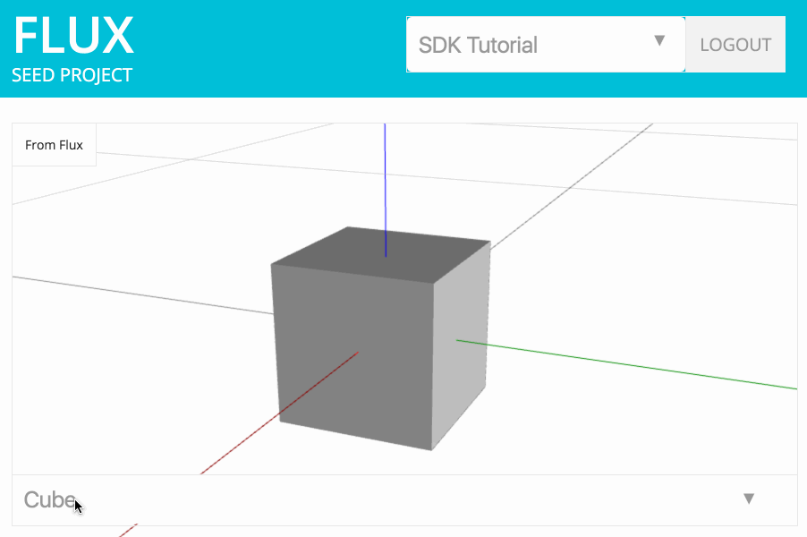

# Chapter 4: Flux Primitives

* [Types of Flux Primitives](#types-of-flux-primitives)
* ["Data, Not Files"](#data-not-files)
* [Collections](#collections)
* [Extending Flux Primitives](#extending-flux-primitives)
  * [Custom Attributes](#custom-attributes)
  * [Embedded Primitives](#embedded-primitives)
* [Units of Measure](#units-of-measure)
* [Handling Non-Geometric Primitives](#handling-non-geometric-primitives)
* [Download Chapter 4 Source Code](#download-chapter-4-source-code)

&nbsp;

In Chapter 3 we looked at an example of how to read JSON data from cells in a project data table. More specifically, we loaded JSON data into a viewport whenever it resembled geometry. 

But how could we tell the difference between JSON that represents geometry, and arbitrary JSON values? Over time, Flux has built a core schema from the different types we've encountered. For example, our cube example is represented by a "block" primitive: 

```json
{
  "dimensions": [
    2,
    2,
    2
  ],
  "origin": [
    0,
    0,
    0
  ],
  "primitive": "block",
  "units": {
    "dimensions": "meters",
    "origin": "meters"
  }
}
```

Similarly, a point primitive is really just:

```json
{
  "primitive":"point",
  "point":[0,1,0],
  "units":{
    "point":"meters"
  }
}
```

While it's not required that you use Flux primitives, you'll get a lot of mileage out of them since they're recognized by our viewport and plugins. This chapter will cover the different primitives available in a bit more detail.

## <a id="types-of-flux-primitives"></a>Types of Flux Primitives

There are many different Flux primitives. You'll expect, and recognize most of them if you've worked with other design tools. For example, you'll find points, lines, curves, meshes, BREPs, and many more. We actively maintain documentation of the different types here.

It's also very simple to create examples of primitives by using the data inspector on https://flux.io. When you view data, the bottom left corner of the data inspector provides a menu of alternative views. The eye in the bottom left corner exposes a menu. The "Raw View" menu item changes the display to show the raw JSON value that will help you understand how geometry (or other types) are constructed.


## <a id="data-not-files"></a>"Data, Not Files"

The unofficial Flux mantra has been, "Data, not files." The design of primitives reflects this belief - that a single model can be decomposed into smaller, reusable parts. 

While it may be tempting to jam a base 64 encoded .dxf into a cell and route it through Flux, it sort of misses the point. Interoperability is more than just speaking a common language. When collaborating, you will greatly benefit by breaking your design down into discrete problems. You'll see the solution to these problems become reusable in many different contexts.

## <a id="collections"></a>Collections

JSON provides everything that is needed to create collections of primitives. Apps should be prepared to receive arrays, or even arrays of arrays of a primitive. For example, an array of points:

```json
[
  {
    "primitive":”point”,
      "point":[0,1,0],
      "units":{
        "point":”meters”
      }
  },
  {
    "primitive":”point”,
    "point":[0,2,0],
    "units":{
      "point":”meters”
    }
  }
]
```

And, keep in mind JSON arrays are not type enforced. The same array may contain different types of primitives.

## <a id="extending-flux-primitives"></a>Extending Flux Primitives

Your app may require detail beyond what is communicated by a Flux primitive. Before you create an entirely new type, consider that there are two ways you can extend Flux primitives beyond their prescribed form:

1. Add your own custom attributes under a designated "attributes" member
2. Embed Flux primitives within your own custom structures

## <a id="custom-attributes"></a>Custom Attributes

In most cases, custom attributes are the recommended approach. The "attributes" member is reserved for your use, anyway you like. For example, you can extend the point primitive we used above as:

```json
{
  "primitive":”point”,
  "point":[0,1,0],
  "units":{
    "point":”meters”
  },
  "attributes":{
    "hello":“world”
  }
}
```

You could have added "hello" outside of the attributes section, but there is always a chance it may collide with a Flux schema change sometime down the road.

## <a id="embedded-primitives"></a>Embedded Primitives

If you really can't live with extending a primitive, the next best thing is to nest a primitive in your own structure. For example, maybe you want to create your own "regularPolygon" primitive. You could embed a known primitive, like point:

```json
{
  "primitive":”regularPolygon”,
  "center":{
    "primitive":”point”,
    "point":[0,1,0],
    "units":{
      "point":”meters”
    }
  },
  "sides":5,
  "outer-radius": 30,
  "inner-radius": 30
}
```

This approach is less preferred because some apps may not know what to do with the top-level primitive "regular-polygon", and ignore it (or even worse, crash). However, at least it's still possible to extract the center value as a point and do something useful with the point.

## <a id="units-of-measure"></a>Units of Measure

[https://community.flux.io/articles/2029/units-of-measure.html](https://community.flux.io/articles/2029/units-of-measure.html)

## <a id="handling-non-geometric-primitives"></a>Handling Non-Geometric Primitives

So far, our app only handles geometric primitives (using the viewport). The viewport does not render non-geometric types - even the basic ones like numbers or strings. Let's address that.

Add a new div to `index.html` for displaying general content without the use of the viewport:

index.html
```html
<div id='output'>
  <div class='label'>From Flux</div>
  <!-- geometry viewport -->
  <div id='geometry'>
    <div id='view'></div>
  </div>
  <!-- general display -->
  <div id='display'>
    <div class='content'></div>
  </div>
  <div class='select'><select class='cell'></select></div>
</div>
```

Then, we need to modify the `render` function in `index.js` to toggle displays based on type. If the general display is showing, we'll do a bit of simple formatting:

```js
function render(data) {
  //check to see if data is available to render
  if (!data) {
    //empty the display and hide the geometry viewport
    $('#display .content').empty()
    $('#display').show()
    $('#geometry').hide()
  }

  //check to see if the data is a known type of geometry
  else if (FluxViewport.isKnownGeom(data.value)) {
    //add it to the viewport
    viewport.setGeometryEntity(data.value)
    //swap the display types
    $('#geometry').show()
    $('#display').hide()
  } else {
    // not geometry, so figure out how to best render the type
    // check if the value is a number
    var d = parseFloat(data.value)
    // otherwise make it into a string
    if (isNaN(d)) d = JSON.stringify(data.value)
    else d = d + ''
    // calculate the approximate display size for the text
    // based on the ammount of content (length)
    var size = Math.max((1/Math.ceil(d.length/20)) * 3, 0.8)
    // apply the new text size to the content
    $('#display .content').html(d).css('font-size', size+'em')
    // if the content is json
    if (d[0] === '[' || d[0] === '{') {
      // align left
      $('#display .content').css('text-align', 'left')
    } else {
      // align center
      $('#display .content').css('text-align', 'center')
    }

    //swap the display types
    $('#geometry').hide()
    $('#display').show()
  }
}
```

Refresh your browser and select one of the cells holding a non-geometric type (like "Color Slider"). You should see it respond by swapping the viewport with a readout of the cell value:



## <a id="download-chapter-4-source-code"></a>Download Chapter 4 Source Code

The files mentioned in this chapter can be conveniently [downloaded here](https://github.com/flux-labs/flux-seed/tree/master/tutorials/chapter_4_primitives). Remember to set your own `flux_client_id` in `config.js` and point your local http server to the new directory!
