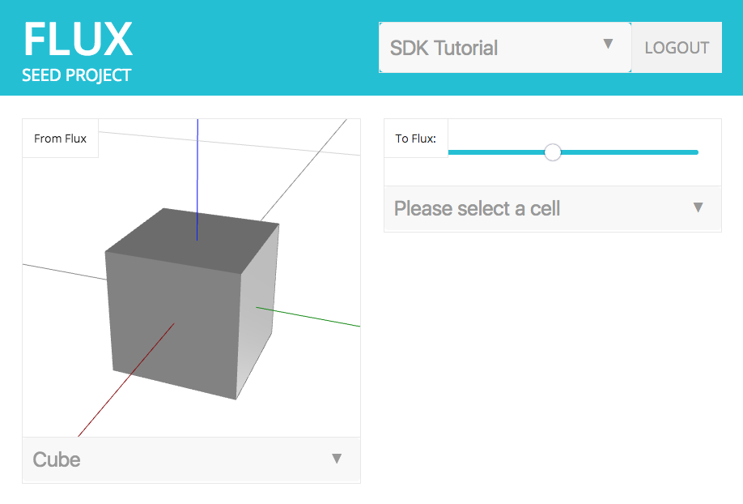
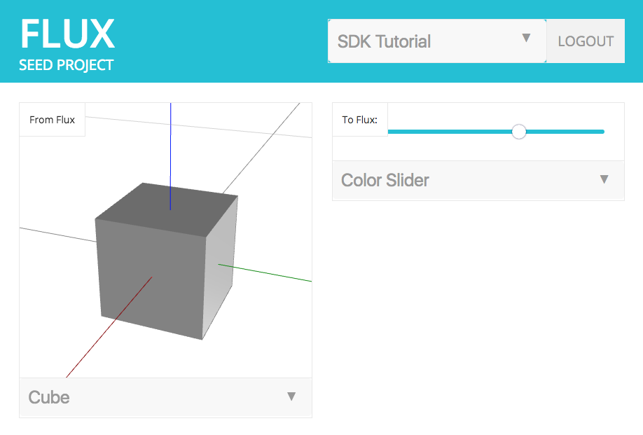
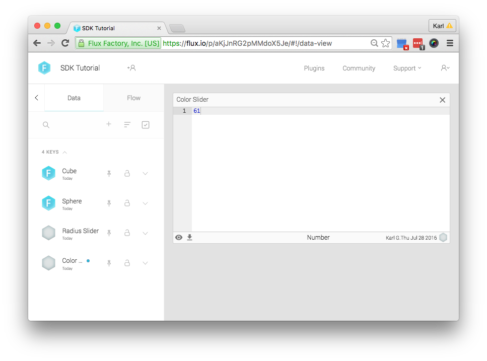
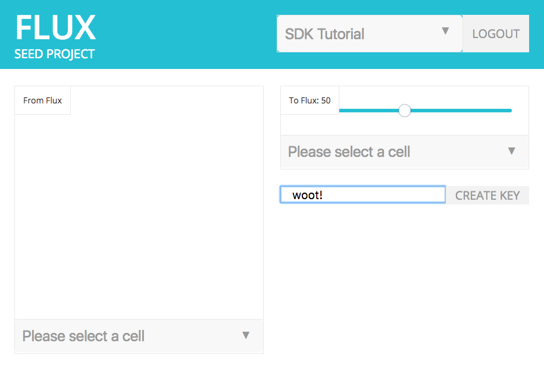
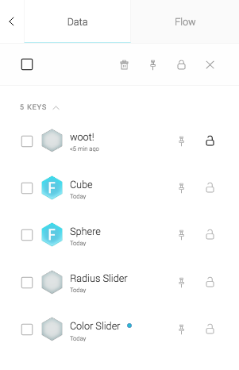

# Chapter 5: Writing Data to Flux

* [Writing Values to a Cell](#writing-values-to-a-cell)
* [Creating Cells](#creating-cells)
* [Write Permissions](#write-permissions)
* [Download Chapter 5 Source Code](#download-chapter-5-source-code)

&nbsp;

In previous chapters we've focused on reading data from Flux, which gets you pretty far because a lot of design work is authored using tools that already connect to Flux. Chapter 4 covered the common types of JSON primitives that are used among Flux-enabled apps. In this chapter, we'll look at how you can write your own data to Flux for other apps to consume.

## <a id="writing-values-to-a-cell"></a> Writing Values to a Cell

We're going to add a new section to the app that allows your user to write values to a cell by adjusting a number slider. Insert the following snippet into `index.html` after the left column div, which creates a new range slider (with the help of jQuery) and list to select a cell that will be written to:

index.html
```html
<!-- right column -->
<div class='column'>
  <!-- input section -->
  <div id='input'>
    <div class='label'>To Flux: <span class='value'></span></div>
    <div id='control'>
      <input type='range'/>
    </div>
    <div class='select'><select class='cell'></select></div>
  </div>
</div>
```

When you refresh your browser, you'll see that a slider and a select list (with cells!) has been added:



Now we can add some code to write to "Slider Value" cell (or any other cell you select). First, add a new function `updateCellValue` to your `js/helpers.js` file. This will do the work of actually sending the value to Flux:

js/helpers.js
```js
/**
 * Update the value in a project cell (key).
 */
function updateCellValue(project, cell, value) {
  var cell = getUser().getCell(project.id, cell.id)
  return cell.update({value: value})
}
```

Modify `initCells` in `js/index.js` by adding the following:

js/index.js
```js
/**
 * Attach events to the cell (key) selection boxes.
 */
function initCells() {
  // attach a function to the change event of the viewport's cell (key) select box
  $('#output select.cell').on('change', function(e) {
    // find the cell that was clicked on
    selectedOutputCell = projectCells.filter(function(k) { return k.id === e.target.value })[0]

    if (selectedProject && selectedOutputCell) {
      // get the value of the cell (returns a promise)
      getValue(selectedProject, selectedOutputCell).then(function(data) {
        // and render it
        render(data)
      })
    }
  })

  // attach a function to the change event of the slider's (input) select box
  $('#input select.cell').on('change', function(e) {
    // find the cell that was clicked on
    var selectedCell = projectCells.filter(function(k) { return k.id === e.target.value })[0]
    // and attach it to the slider so we can grab it later
    $('#input input').data('cell', selectedCell)
  })

  // attach a function to the change event of the slider
  $('#input input').on('change', function(e) {
    // find the cell that was clicked on (we attached it in the previous function)
    var cell = $(e.target).data('cell')
    // update the display with the new value
    $('#input .label .value').html(e.target.value)
    // and if we have a cell
    if (cell) {
      // tell flux to update the cell with this new value
      updateCellValue(selectedProject, cell, parseFloat(e.target.value))
    }
  })

  // initialize the slider's displayed value
  $('#input .label .value').html($('#input input').val())
}
```

This adds an event handler to the list that chooses a cell. The handler is called when the slider value changes, and we respond by calling `updateCellValue` to write the value to Flux.

Refresh your browser, and choose the "Slider Value" cell from the list of options. Then, change the slider value:



When you log in to flux.io and inspect the value of "Slider Value" (double click on it), you'll notice that the value updates as you change it in your app:



## <a id="creating-cells"></a>Creating Cells

So far, the cells we've been working with in the "SDK Tutorial" project were all created automatically for you. Now we're going to add the ability to create new cells from your app. Add a new div to `index.html` after the content in the right column:

index.html
```html
<!-- right column -->
<div class='column'>
  <!-- input section -->
  <div id='input'>
    <div class='label'>To Flux: <span class='value'></span></div>
    <div id='control'>
      <input type='range'/>
    </div>
    <div class='select'><select class='cell'></select></div>
  </div>
  <div id='create'>
    <input type='text'></input>
    <div class='button'>CREATE KEY</div>
  </div>
</div>
```

We've added an input for your user to type in the name for their cell, along with a button to submit that input. Next, we'll add a helper function `createCell` in `js/helpers.js` to add the key to a project's data table.

js/helpers.js
```js
/**
 * Create a project cell (key) in Flux.
 */
function createCell(project, name) {
  var dt = getDataTable(project).table
  return dt.createCell(name, {description: name, value: ''})
}
```

Next, we'll add a function named `initCreate` to `js/index.js` just above `init`. This function will listen for the create button to be clicked, then submit the input text for the cell name to `createCell` using the selected project. Once created, cells in each list will be refreshed by `fetchCells`.

js/index.js
```js
/**
 * Initialize the create cell (key) input + button.
 */
function initCreate() {
  $('#create .button').on('click', function(e) {
    // get the input field
    var input = $(e.target).parent().find('input')
    // get the input field value
    var value = input.val()
    // check we have a name
    if (value === '') return
    // check we have a project selected
    if (!selectedProject) return
    // create the cell (key)
    createCell(selectedProject, value).then(function() {
      // clear the input
      input.val('')
      // refresh the cell (key) select boxes
      fetchCells()
    })
  })
}
```

Last, we need to call `initCreate` from our `init` function to make sure the button click handler is listening before the user is able to interact with the app:

js/index.js
```js
function init() {
  // Check if we're coming back from Flux with the login credentials.
  helpers.storeFluxUser()
  // check that the user is logged in, otherwise show the login page
    .then(function() { return helpers.isLoggedIn() })
    .then(function(isLoggedIn) {
      if (isLoggedIn) {
        // if logged in, make sure the login page is hidden
        hideLogin()
        // create the viewport
        initViewport()
        // prepare the cell (key) select boxes
        initCells()
        // prepare the create key input + button
        initCreate()
        // get the user's projects from Flux
        fetchProjects()
      } else {
        showLogin();
      }
    })
}
```

Refresh your browser, and you should see the input field and button:



Go ahead and type the name of your cell, then submit your request using the "CREATE KEY" button. It might seem like nothing happened, but you should see that the “key” was created when you log into [https://flux.io](https://flux.io) and view the data table for your project.



## <a id="write-permissions"></a>Write Permissions

You'll need to be careful when attempting to write values to a cell. There are two conditions in which a cell may be read-only:

1. The cell exists within a project that your user is only allowed to read from.
2. The cell is marked as "protected".

When your user attempts writing to write values to a cell without permission, the SDK will throw an exception. At the very least, you'll want to anticipate an exception and handle it accordingly.

## <a id="download-chapter-5-source-code"></a>Download Chapter 5 Source Code

The files mentioned in this chapter can be conveniently [downloaded here](https://github.com/flux-labs/flux-seed/tree/master/tutorials/chapter_5_write). Remember to set your own `flux_client_id` in `config.js` and point your local http server to the new directory!
