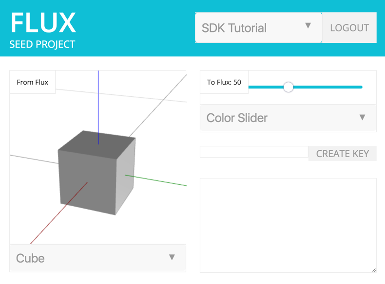
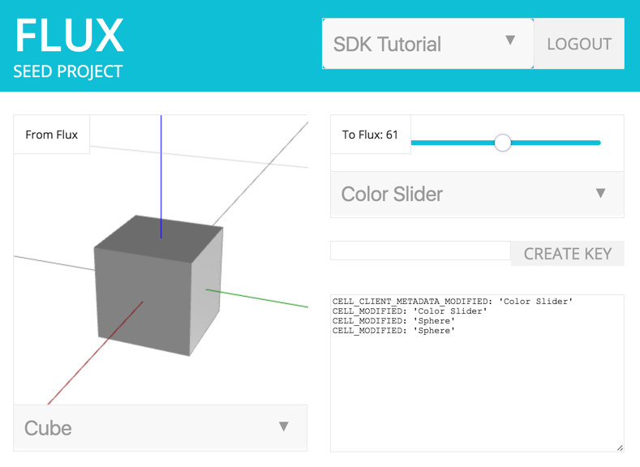
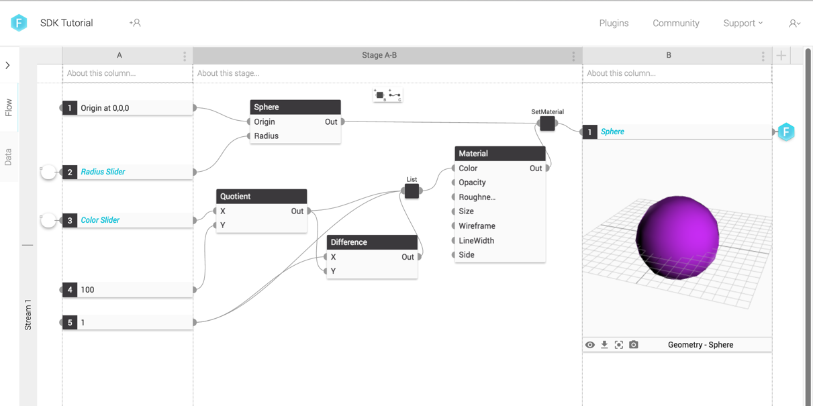
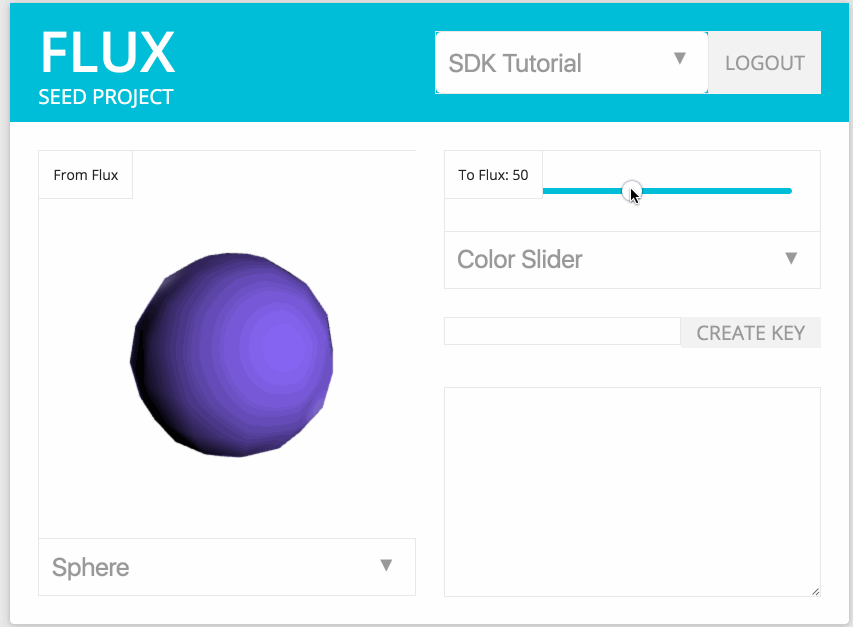

# <a id="chapter-6"></a>Chapter 6: Responding to Changes

* [Listening for Changes](#listening-for-changes)
* [Applying Changes](#applying-changes)
* [Download Chapter 6 Source Code](#download-chapter-6-source-code)

&nbsp;

So much goodness -- but you still haven’t seen the truly compelling case for using the Flux SDK. When a cell value is written to by another application, your app can receive notifications and respond accordingly. For example, a user working in SketchUp could write a cell value using the Flux plugin, and immediately trigger a change in your app (assuming you let it).

In this chapter, we’re going to:

* Add the ability to detect changes to a project/data table (outside of your app)

* Add a console that records every change notification received for the selected project

* Refresh the viewport for the selected cell whenever a change for that cell value occurs

## <a id="listening-for-changes"></a>Listening for Changes

There are many types of changes that can occur at the project/data table level. This is not an exhaustive list of notification types, but to name a few:

* CELL_CREATED: A new cell was added to the data table

* CELL_DELETED: An existing cell was removed from the data table

* CELL_MODIFIED: The value of a specific cell was modified

* CELL_CLIENT_METADATA_MODIFIED: Metadata for a specific cell, like timestamp, label or description was modified

Again, types of notification types may change over time. It’s important to anticipate that in the code you write.

To start things off, let’s add a new section to index.html at the bottom of the right column. This will create a textarea element that will be used like a console to print out notifications as they are received:

```html
<!-- right column -->
<div class='column'>
  <!-- input section -->
  <div id='input'>
    <div class='label'>To Flux: <span class='value'></span></div>
    <div id='control'>
      <input type='range'/>
    </div>
    <div class='select'><select class='cell'></select></div>
  </div>
  <div id='create'>
    <input type='text'></input>
    <div class='button'>CREATE KEY</div>
  </div>
  <div id='notifications'>
    <textarea id='console'></textarea>
  </div>
</div>
```

Now we’re going to add a helper function to helpers.js called createWebSocket. This will create a [WebSocket](https://en.wikipedia.org/wiki/WebSocket) that holds a persistent connection with Flux, so information can flow bidirectionally as needed. More specifically, Flux servers will send messages to your app through the WebSocket whenever something interesting happens.

```js
/**
 * Creates a websocket for a project that listens for data table events, and calls
 * the supplied handler function
 */
function createWebSocket(project, notificationHandler){
  var dataTable = getDataTable(project)
  var options = {
    onOpen: function() { console.log('Websocket opened.') },
    onError: function() { console.log('Websocket error.') }
  }
  // if this data table doesn't have websockets open
  if (!dataTable.websocketOpen) {
    dataTable.websocketOpen = true
    // open them
    dataTable.table.openWebSocket(options)
    // and attach the handler we created above
    if(notificationHandler)
      dataTable.table.addWebSocketHandler(notificationHandler)
  }
}
```

Last, we need to create the WebSocket whenever the selected project changes. We’ll do this by modifying the change event handler in the fetchProjects function within index.js:

```js
function fetchProjects() {
  // get the user's projects from flux (returns a promise)
  getProjects().then(function(data) {
    projects = data.entities
    // for each project, create an option for the select box with
    // the project.id as the value and the project.name as the label
    var options = projects.map(function(project) {
      return $('<option>').val(project.id).text(project.name)
    })

    // insert the default text as the first option
    options.unshift('<option>Please select a project</option>')
    // make sure the select box is empty and then insert the new options
    $('select.project').empty().append(options)
    // empty out the project cell (key) select boxes
    $('select.cell').empty()
    // attach a function to the select box change event
    $('select.project').on('change', function(e) {
      // find the project that was clicked on, and assign it to the global
      // variable 'selectedProject'
      selectedProject = projects.filter(function(p) { return p.id === e.target.value })[0]
      var c = $('#console')
      c.val('')
      var notificationHandler = function(msg) {
        //write all events to the app console
        c.val(c.val() + msg.type + ': \'' + msg.body.label + '\'\n')
      }

      //listens and responds to changes on flux using our handler
      createWebSocket(selectedProject, notificationHandler)
      // now go fetch the project's cells (keys)
      fetchCells()
    })
  })
}
```

The code above introduces a notificationHandler function that will be called whenever the WebSocket receives a message from Flux. For now, the handler will simply print the message type and relevant cell’s label to the app’s console. Refresh your browser window and select a project:



Change the value of the sider for "Cube Opacity" and you should see messages printed in the app console:



Also, notice that creating or deleting a cell on Flux (for the selected project) will also print a message in your console. You’ve just made your app responsive to the outside world!

## <a id="applying-changes"></a>Applying Changes

The console is useful for you as a developer. You can see what is changing, and when. However, your users will probably expect your app to do something more relevant.

As an example, we’re going to re-render the viewport when the CELL_MODIFIED notification is received. This is simple, since it requires only that we add a check inside of our notificationHandler function:

```js
var notificationHandler = function(msg) {
  //write all events to the app console
  c.val(c.val() + msg.type + ': \'' + msg.body.label + '\'\n')
  if (msg.type === "CELL_MODIFIED") {
    //only render when the modification involves the selected output
    if(selectedOutputCell && (selectedOutputCell.id === msg.body.id)) {
      getValue(selectedProject, selectedOutputCell).then(render)
    }
  }
}
```

This code block will ignore anything that isn’t related to a cell modification. Also, it will check to make sure the notification is for the same cell that is currently selected in the "From Flux" view by comparing cell ids.

The SDK Tutorial project applies some server side magic with Flux, by assigning values written by your app slider to geometry. It will use the radius and color values set by the slider to dynamically create new geometry in a cell named "Sphere".



Select "Sphere" in your app’s viewport. When you change the color or radius cell values with your slider, the server based flow in your project will execute and generate a new sphere. Your app will refresh its viewport, and display the updated sphere every time it re-generates!



## <a id="download-chapter-6-source-code"></a>Download Chapter 6 Source Code

The files mentioned in this chapter can be conveniently [downloaded here](https://github.com/flux-labs/flux-seed/tree/master/tutorials/chapter_6_changes). Remember to set your own flux_client_id in config.js and point your local http server to the new directory!
